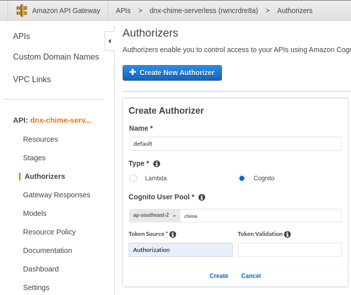
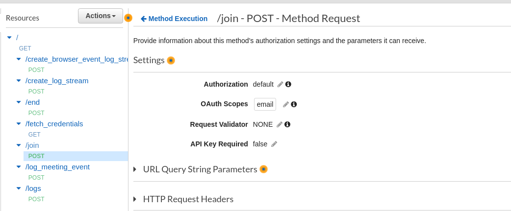

# API Gateway cognito Authorization

### Create an authorizer

### Attach the authorizer to the resource

> All requests to the api should contain the header `Authorization` with cognito token to be able to fetch data.