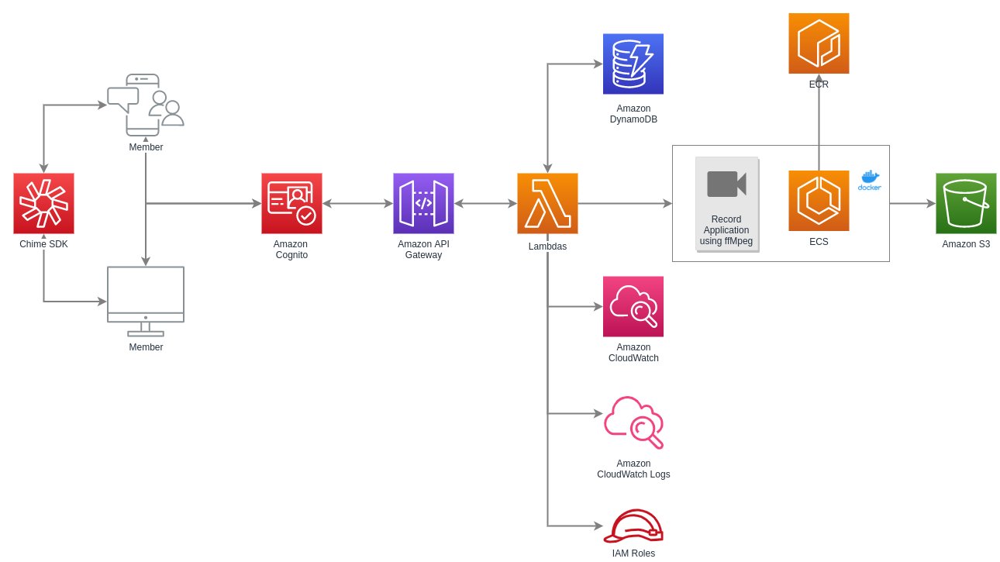

# aws-chime-demo

- [Android](amazon-chime-sdk-android)
- [Browser](browser)
- [Serverless](serverless)
- [Recording](recording)
- [Singlejs](singlejs)

## Docs

- [Cognito](COGNITO.md)
- [Chime](CHIME.md)

Amazon Chime SDK Meeting Demo URL:

https://chime.labs2.dnx.host/

Recording API: https://chime.labs2.dnx.host/recording/recording

## HLD

## Meeting extend information

The meetings end when you run the [DeleteMeeting](https://docs.aws.amazon.com/chime/latest/APIReference/API_DeleteMeeting.html) API action. A meeting automatically ends after a period of inactivity, such as the following:

- No audio connections are present in the meeting for more than five minutes.

- Less than two audio connections are present in the meeting for more than 30 minutes.

- Screen share viewer connections are inactive for more than 30 minutes.

- The meeting time exceeds 24 hours.

## Pricing

### Amazon Chime SDK

The developers of a learning management system (LMS) have integrated the Amazon Chime SDK into the solution to allow students to attend live lectures from their web application. The application hosts 100 weekly sessions for its students. Each course includes 1 instructor and 29 students, and is 60 minutes in duration. The application allows instructors to share webcam video and share content (i.e. screen share) at all times. Students can listen to instructors’ audio, and raise their hand to ask questions or participate in discussions with audio and webcam video.

In this example the cost for Amazon Chime SDK is:

**Each Course Session**
30 attendees × 60 minutes × $0.0017 per attendee-minute = $3.06 per course session

**Total Cost per Week**
$3.06 per course session × 100 course sessions per week = $306 per week

* May incur additional charges for using other services or products.

> Except as otherwise noted, our prices are exclusive of applicable taxes and duties.

### Amazon Chime Basic and Voice Connector

Consider a company of 50 employees wanting an easy way to chat, and to make outbound phone calls to the public telephone network. The company uses Amazon Chime Basic to chat and hold one to one Chime video calls. The company averages 11,100 monthly minutes of US outbound calls that are connected to the public switch telephone network with Amazon Chime voice connector.

The cost for Amazon Chime Basic and Voice Connector is:

**Amazon Chime Basic** = Free*

**Outbound Minute Usage Cost** = 11,100 (minutes) x $0.0048 (per minute) = $53.28

**Total monthly cost:** $53.28**

* May incur additional charges for using other services or products.

> Except as otherwise noted, our prices are exclusive of applicable taxes and duties.

### Amazon Chime Pro and Business Calling

Consider a company of 100 employees that needs a solution which will allow users to communicate with internal and external colleagues. There are three types of users in this group, one that hosts daily meetings, one that occasionally (1-3 days per month) hosts meetings and users who do not schedule or host meetings. The company uses 10,000 toll freedial in minutes per month for their meetings. Using business calling the company provides a business phone number, for all 100 employees. Users send 10,000 outbound, 7,500 inbound text messages, they receive inbound calls for a total of 11,100 inbound minutes and the make outbound calls for a total of 22,200 outbound minutes all within the US.

**In this example the cost for Amazon Chime Pro and Business Calling is:**

**Amazon Chime Pro** = $420 per month

20 users x $3 per day x 5 days per month = $300 per month

10 users x $3 per day x 3 days per month = $90 per month

10 users x $3 per day x 1 day per month = $30 per mont

**Amazon Chime Dial-in US Toll Free** = $119.10

10,000 minutes x $0.011910 per minute = $119.10

**Amazon Chime Business Calling** (with text and both inbound and outbound calling features enabled) = $381.16

(100 numbers x $1 per number) = $100

+ (10,000 outbound messages x $0.015 per message) = $150

+ (7,500 inbound messages x $0.00 per message) = $0.00

+ (11,100 inbound minutes x $0.002216 per minute) = $24.60

+ (22,200 outbound minutes x $0.0048 per minute) = $106.56

**Total monthly cost:** $420 + $119.10 + $381.16 = $920.26*

> Except as otherwise noted, our prices are exclusive of applicable taxes and duties.